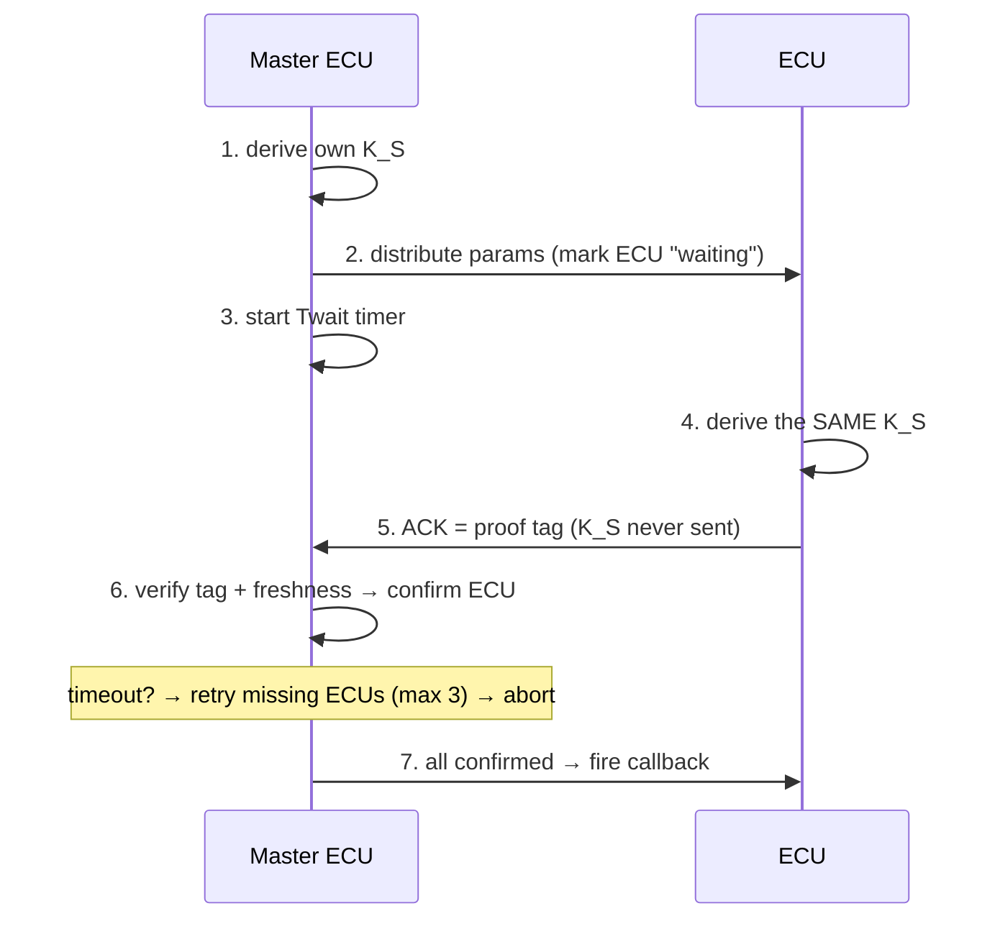

# CAN XL — Session Key Distribution

A C++ model of **Phase 1 (Key Distribution)** of a CAN XL in-vehicle security
architecture. A *Master ECU* generates key-derivation parameters, every ECU
independently derives the **same session key `K_S`** from a shared master key
`K_M`, proves it without ever sending `K_S`, and the Master tracks, retries, and
finally confirms the whole fleet.

> Builds & runs on **macOS** and inside the **Linux dev container**. 22 unit tests, both environments green.

---

## How it works (step by step)



| # | What happens | Function in this code |
|---|--------------|-----------------------|
| 1 | Master derives its own `K_S` | `setNonce()` + `calculateSessionKeyKBKDF()` |
| 2 | Master sends params to each ECU | `markDataSent(ecuId)` → state `WAITING_THE_RESPONSE` |
| 3 | Master starts the wait timer | `SessionKeysInputsAreSent()` |
| 4 | Each ECU derives the **same** `K_S` | `calculateSessionKeyKBKDF()` |
| 5 | ECU builds an ACK proof tag | `calculateSessionKeyTag(ecuId, nonce)` |
| 6 | Master verifies tag + freshness, confirms ECU | `markResponseReceived(ecuId, tag, nonce)` → `checkSessionKeyIsCorrect()` |
| — | Missing ECU on timeout → resend (≤ 3) → abort | `checkECUs()` → `resentTheMessage()` |
| 7 | All ECUs confirmed → notify the app | `setOnAllConfirmed()` → `allConfirmed()` |

Each ECU's status lives in a tracking table (`std::map<ECU_ID, ECUMode>`) moving
through: `INITIAL_STATE → WAITING_THE_RESPONSE → RECEIVED_THE_RESPONSE`
(or `RESENT_THE_INPUTS` while retrying).

---

## Key derivation: KBKDF & HKDF

The session key is a pure function of the inputs, so **every ECU derives the
identical key** (no per-instance randomness):

```
K_S = KDF( K_M , Label , Context )      Context = ECU_ID ‖ Counter (nonce)
```

Two interchangeable algorithms are provided:

| KDF | Standard | Primitive | Role |
|-----|----------|-----------|------|
| **KBKDF** | NIST SP 800-108 (Counter mode) | CMAC-AES | **default** |
| **HKDF**  | RFC 5869 | HMAC-SHA256 | alternative |

A fresh **Counter** in the nonce yields a fresh `K_S` each session (forward
secrecy); the same Counter always yields the same key (so ECUs agree).

---

## Security notes

- **Key confirmation** — an ECU proves it derived the right key by sending
  `HMAC(K_S, ECU_ID ‖ SHA256(K_S) ‖ nonce)` truncated to 64 bits. `K_S` never
  travels on the bus; the Master re-computes the tag and compares.
- **Replay protection** — the Master keeps the highest accepted nonce counter
  per ECU (`last_nonce_counter`) and rejects any counter `≤` it.
- **⏱ Timing-attack safe** — tags are compared with **`CRYPTO_memcmp`**, not
  `==`. A normal compare returns early on the first differing byte, leaking
  timing an attacker could exploit; `CRYPTO_memcmp` takes constant time
  regardless of where (or whether) the bytes differ.

---

## Build & run

```bash
# macOS
cmake --preset vscode && cmake --build --preset vscode
./build/cankeydist          # demo
ctest --preset vscode       # tests

# Linux / dev container
cmake --preset container && cmake --build --preset container
./build-linux/cankeydist
ctest --preset container
```

Requires **OpenSSL ≥ 3.0** (for the `EVP_KDF` KBKDF/HKDF API) and CMake ≥ 3.20.
